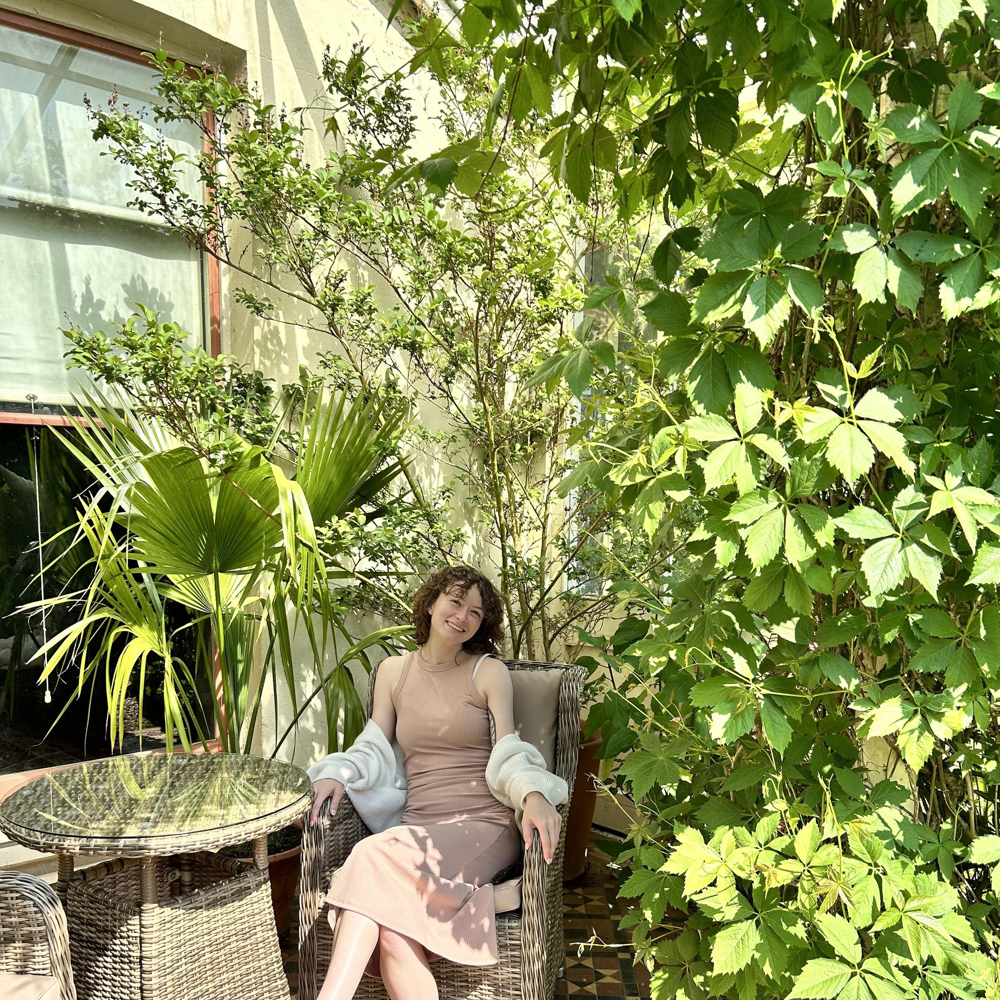

<!DOCTYPE html>
<html lang="en">
<head>
  <meta charset="UTF-8">
  <meta name="viewport" content="width=device-width, initial-scale=1.0">
  <title>Hailey Cantwell - Professional Portfolio</title>
  
</head>
<body>

<!-- Sidebar -->
<nav id="sidebar" class="sidebar">
  

    
    <h2>Hailey Cantwell</h2>
    
Concord, NH

    
Southern New Hampshire University

    
Bachelor's in Child and Adolescent Psychology

    
<a href="mailto:hailey.cantwell@snhu.edu">Email Me</a>

    
<a href="https://www.linkedin.com/in/hailey-c-7a7204132" target="_blank">LinkedIn Profile</a>

  

</nav>

<button id="toggle-btn" class="toggle-btn">☰ Menu</button>

<header>
  <h1>Hailey Cantwell - Professional Portfolio</h1>
  <h3>Welcome to Hailey Cantwell's GitHub Page!</h3>
</header>

  <section class="resume-section">
    <h2>About Me</h2>
    
Hello! I'm Hailey Cantwell, a senior studying psychology with a concentration in child and adolescent development and a minor in research. I am passionate about understanding and improving the lives of children through research and evidence-based practices.

  </section>

  <section class="resume-section">
    <h2>Projects & Research</h2>
    

      <h3>MAT434 Repository</h3>
      
Explore my coursework for MAT434, including research, analysis, and statistical models.

      <a href="https://haileycantwell.github.io/MAT434/" target="_blank">Visit Repository</a>
    

    

      <h3>Research on Parenting Styles & Screen Time</h3>
      
Researching relationships between parenting styles, parental stress, and children's screen time habits.

    

    

      <h3>Thesis: Intergenerational Addiction & Technology</h3>
      
Investigating the impact of intergenerational addiction on children's technology-related compulsive behaviors.

    

  </section>

</body>
</html>
